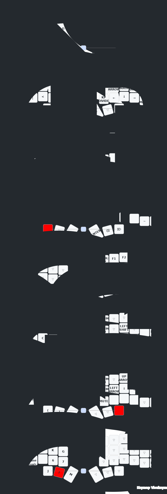
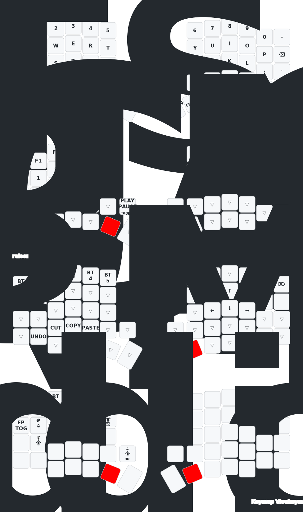
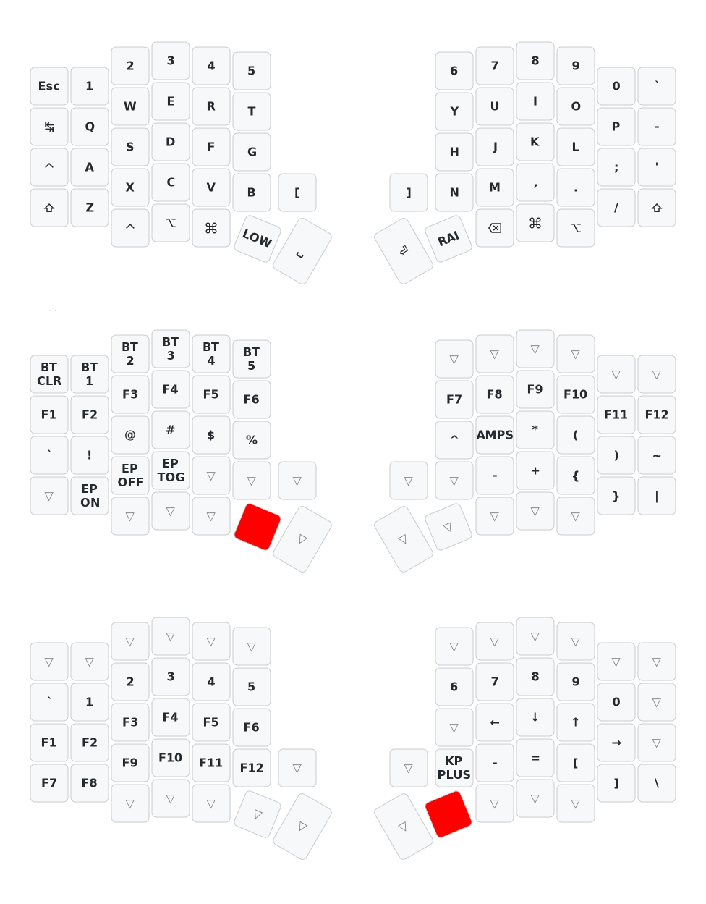
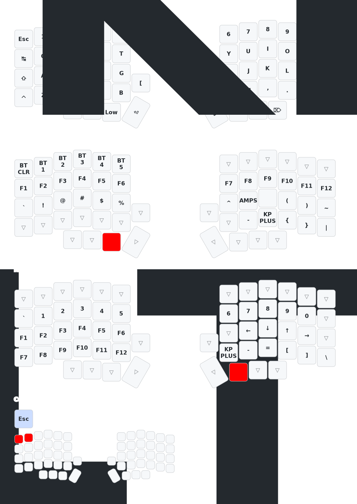
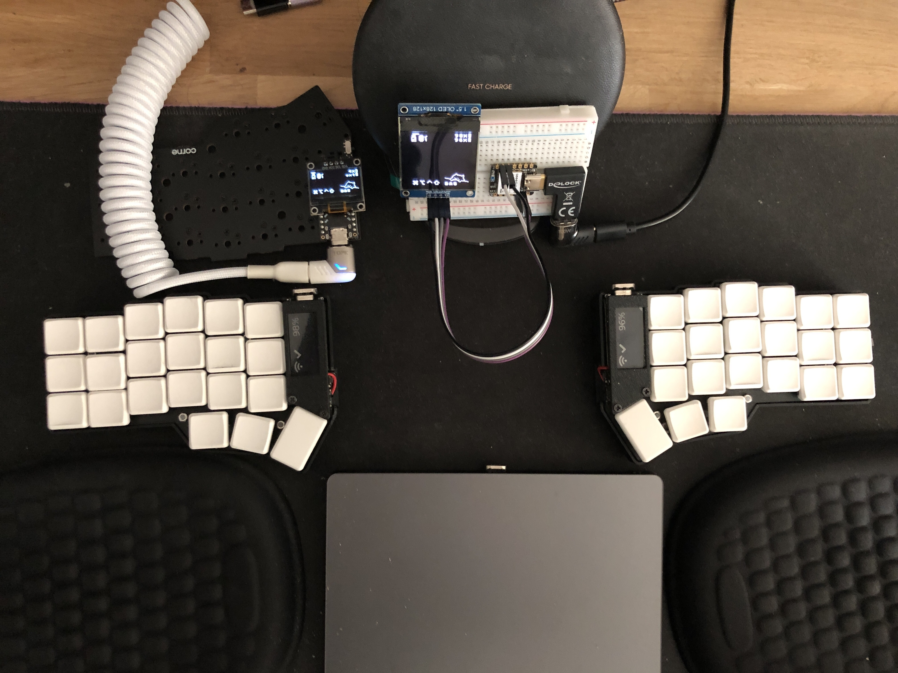
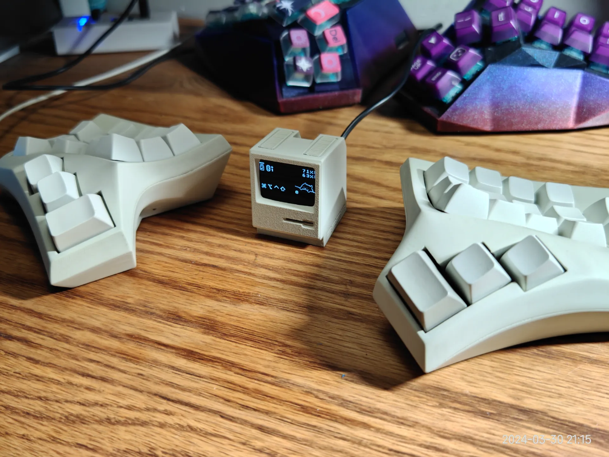

# MC Technology's zmk-config for corne - sofle - lily58

[](https://www.youtube.com/channel/UC_mYh5PYPHBJ5YYUj8AIkcw)

<div align="center">

  [][youtube]
  [][facebook]
  [][reddit]

</div>
<br>


- [INTRO](#INTRO)
- [QUICK START](#QUICK-START)
  - [keymap corne](#keymap-corne)
  - [keymap sofle](#keymap-sofle)
  - [keymap splitkb_aurora_sofle](#keymap-splitkb_aurora_sofle)
  - [keymap lily58](#keymap-lily58)
- [LOCAL INSTALLATION](#LOCAL-INSTALLATION)
- [DISPLAY](#DISPLAY)
- [RGB](#RGB)
  - [rgb with niceview](#rgb-with-niceview)
  - [rgb with niceview in two step](#rgb-with-niceview-in-two-step)
- [DONGLE](#DONGLE)
- [USEFUL TIPS](#USEFUL-TIPS)
- [ZMK STUDIO](#ZMK-STUDIO)
- [MODULE INTEGRATION](#MODULE-INTEGRATION)
   - [modules used in this repository](#modules-used-in-this-repository)
   - [list of useful modules](#list-of-useful-modules)
- [THIS REPOSITORY AS A MODULE](#THIS-REPOSITORY-AS-A-MODULE)
- [INSPIRATIONS](#INSPIRATIONS)
- [MY OTHER PROJECTS](#MY-OTHER-PROJECTS)
- [RELATED PROJECTS](#RELATED-PROJECTS)
- [DONGLE DESIGNS](#DONGLE-DESIGNS)

----

- If you already have your corne - sofle - lily58 configured with this repository and want to make
a modification to your keymap, you can do it with the online [ZMK-STUDIO](https://zmk.studio/).

- If you already have your corne - sofle - lily58 configured with this repository and want to make
a modification to your keymap, you can do it with the online [keymap-editor](https://nickcoutsos.github.io/keymap-editor/).

- If you already have a repository and you want only the dongle option of this repository with support for `zmk-studio`, just add this repository as a module to your configuration, look the section [THIS REPOSITORY AS A MODULE](#THIS-REPOSITORY-AS-A-MODULE).

# INTRO

> [!CAUTION]
>
> I AM NOT RESPONSIBLE FOR ANY DAMAGE THIS CODE MAY CAUSE, USE IT AT YOUR OWN
> RISK.

> [!NOTE]
>
>
> FEEL FREE TO MODIFY THE CODE TO YOUR LIKING OR USE WHATEVER YOU NEED. I
> DECIDED TO REVOKE MANY CHANGES AND RETURN TO THE BASE MAPPING, SO THAT
> ADVANCED AND NON-ADVANCED  USERS CAN USE THIS REPOSITORY AS A BASE FOR THEIR
> CONFIGURATIONS. IF YOU HAVE ANY QUESTIONS, DON'T HESITATE TO ASK. IF YOU HAVE
> ANY SUGGESTIONS, FEEL FREE TO SUGGEST.


The objective of this repository is to serve as a base for configuring your
corne - sofle - lily58 keyboard with the firmware [ZMK firmware] in a simple and fast way.
without having to configure everything from scratch. Many of us are fascinated
by customizing our keyboards, but sometimes we don't have the time or
experience to do it. That is why I have decided to create this repository so
that you can have a base configuration and you can modify it to your liking.

This base includes the most recent corne - sofle - lily58 configurations, featuring a setup for
the corne - sofle - lily58 dongle with/without an OLED screen.
You can also use your keyboard WITH / WITHOUT a dongle of course. with any of the
plates or screens you have.

Tested with **[puchi_ble_v1]** (used as a dongle and as
peripherals), **[nice_nano_v2]** (used as a dongle and as peripherals),
**clones of nice_nano_v2** (used as a dongle and as peripherals), and the
**[seeeduino_xiao_ble]** (used only as a dongle).

| Main Pros                                                                                       |
|-------------------------------------------------------------------------------------------------|
| mobility and flexibility                                                                        |
| reduction of tension and fatigue (ergonomic and ortholinear)                                    |
| improved productivity                                                                           |
| bluetooth and usb-c connection                                                                  |
| Highly customizable programmable with [ZMK firmware].                                           |
| compatibility with linux, windows, macos, android, ios and more                                 |
| completely wireless between the two halves and with the PC                                      |
| ultra-low consumption. extends battery life to the limit                                        |
| drag and drop thanks to the included uf2 bootloader                                             |
| no additional software required for flashing                                                    |
| support for multiple devices (up to 5)                                                          |
| mouse keys                                                                                      |
| rgb                                                                                             |
| macros                                                                                          |
| tap dance                                                                                       |
| combos                                                                                          |
| up to 1 week of use without charger (with 100mah)                                               |
| support [nice-view] screen and oled screen                                                      |
| online editor for keymap. see               [keymap-editor]                                     |
| 100% open source                                                                                |
| support for puchi-ble dongle, nice!nano v2, nice!nano v2 clones, seeeduino xiao ble and more... |
| support with dongle with display 128x32, 128x64 and 128x128                                     |
| and more...                                                                                     |

# QUICK START
> [!NOTE]
>
> 1. With this configuration you can use the corne - sofle - lily58 keyboard practically
> immediately, you just have to follow the following steps and that's it.
>
> 2. If you need precompiled files you can download them from the [firmware
>    folder](./firmware)
>
> 3. If you have any problems, you just have to flash the reset firmwares that
>    are in the [firmware](./firmware) folder and that's it.
>
> 4. Disable the builds you don't need in the file [build.yaml](./build.yaml),
>    by default they are all activated.


### zmk-studio (quick start)
This repository includes the necessary configuration to use zmk-studio without
the need to configure anything else. You just have to follow the steps below:
- fork this repository y flash the firmware to the keyboard with the uf2 files (see as below en normal procedure)
- connect the master (dongle or central) to the PC
- Modify the keyboard mapping on the go with [ZMK Studio
  Web](https://zmk.studio/) and enjoy the changes!

### normal procedure
1. Fork this repository (I appreciate if you follow me on [github] and [youtube])
2. Modify the keyboard mapping with [keymap-editor]. If you want to read about
   the features of this editor you can do so here: [ZMK Studio Web](https://zmk.studio/) or [keymap-editor](https://github.com/nickcoutsos/keymap-editor).
3. Save changes and commit (optional)
4. Go to actions on github and download the artifacts
   - Actions(click) -> All Workflows (click)-> Initial User Config. (here you
     scroll to the bottom and click)
   - Here is something called artifacts, click to download the file, it is a .zip
   - now go to download on your computer (or wherever you have downloads by default):
   - unzip the .zip file
   - Connect the nice!nano v2 microcontroller to the USB-C port of your computer
   - the microcontroller is recognized as a storage device
5. Flash the firmware to the keyboard with the uf2 files (drag and drop and WITH dongle)
   - xiao_corne_dongle_xiao_dongle_display.uf2 for [seeeduino_xiao_ble] as a dongle
   - nice_corne_left_peripheral.uf2 for [nice_nano_v2] as a peripheral
   - nice_corne_right.uf2 for [nice_nano_v2] as a peripheral
6. Flash the firmware to the keyboard with the uf2 files (drag and drop and WITHOUT dongle)
   - nice_corne_left.uf2 for [nice_nano_v2] as a master side
   - nice_corne_right.uf2 for [nice_nano_v2] as a peripheral
7. If you need help, you can ask in the [ZMK Discord]
8. Enjoy your new keyboard

Here you can see the visual changes to the configuration:
> [!NOTE]
>
> This .svg image is automatically generated every time a change is made with
> the keymap editor. Github's workflows are responsible for building and
> generating the .svg file. You just have to go to the
> [keymap-drawer](./keymap-drawer)  folder and open the .svg file with your
> preferred browser if you want to see the files. The keymap-drawer
> configuration file is located in
> [config](./config/config_keymap-drawer.yaml).
> The file for the workflows is in [workflows](./.github/workflows/keymap-drawer.yaml) in case you want to modify it.

## keymap corne
[](https://www.youtube.com/c/mctechnology17)
## keymap sofle
[](https://www.youtube.com/c/mctechnology17)
## keymap splitkb_aurora_sofle
[](https://www.youtube.com/c/mctechnology17)
## keymap lily58
[](https://www.youtube.com/c/mctechnology17)

If you want to customize this image with shapes/colors/etc. You can see these references:
[^1] [^2] [^3]


# LOCAL INSTALLATION
Before making any modifications, please see the [ZMK documentation]
documentation.

Example of an advanced configuration hier -> [^4]

1. Clone _your fork_ of this repository.

   ```bash
   # Replace `mctechnology17` with your username
   git clone https://github.com/mctechnology17/zmk-config.git
   ```

2. Enter the repository.

   ```bash
   cd zmk-config
   ```

Here you have a preview of how the repository is organized:

```bash
zmk-config # main folder
├── LICENSE # license
├── Makefile # file for compilation
├── README.md # readme this file
├── build.yaml # config file for compilation on the github server
│   boards
│   ├── ... # other boards
│   ├── nice_nano_v2.overlay
│   ├── puchi_ble_v1.overlay
│   └── shields
│       ├── corne
│       │   ├── Kconfig.defconfig # modify if you want to add a new shield
│       │   ├── Kconfig.shield # modify if you want to add a new shield
│       │   ├── boards
│       │   │   ├── ... # other boards
│       │   ├── corne.conf # general configurations of the corne
│       │   ├── corne.dtsi # default dtsi
│       │   ├── corne.keymap # default keymap
│       │   ├── corne.zmk.yml # modify if you want to add a new shield
│       │   ├── corne_dongle_pro_micro.conf # conf dongle pro_micro pinout
│       │   ├── corne_dongle_pro_micro.overlay # properties/displays dongle
│       │   ├── corne_dongle_xiao.conf # conf dongle xiao pinout
│       │   ├── corne_dongle_xiao.overlay # properties/displays dongle
│       │   ├── corne_left.conf # conf left
│       │   ├── corne_left_peripheral.conf # config left peripheral
│       │   ├── corne_right.conf # conf right
│       │   ├── ... # other files
│       └── dongle_display
│           ├── ... # here you can modify the screen widgets
│           └── widgets
│               └── # here you can modify the screen widgets
│   config # configuration folder
│   ├── config_keymap-drawer.yaml # config file keymap-drawer
│   ├── corne.conf # general configurations of the corne
│   ├── corne.keymap # your keymap file
│   ├── keymap_german_mac_iso_zmk.h # example of definition for german mac iso
│   └── west.yml # conf to connect with the repository
├── firmware
│   └── *.uf2 # all the firmwares
├── keymap-drawer # folder with the keymap-drawer
│   ├── corne.svg # img of the keymap
│   └── corne.yaml # keymap file yaml format for keymap-drawer
└── src
    └── ... # other files
```

To compile with make, just run the following command:

> [!IMPORTANT]
>
> 1. You have to have [docker](https://www.docker.com/products/docker-desktop/)
>    installed on your computer to use this command.
> 2. Check the [makefile](./makefile) file for build options.


```bash
make codebase_urob # clones urob's zmk firmware and initializes it
make corne_urob # compile all the *.uf2 of the corne and copy them to the firmware folder
```

# DISPLAY
1. ePAPER
   - The nice!view is a SSD1306 OLED replacement boasting >1,000x power savings
     while keeping a 30Hz refresh rate. It has a similar pinout to SSD1306
     OLEDs with one extra pin making it easy to add on to existing boards.
   - the [nice-view] screen is compiled by default in this repository.
2. OLED
   - SSD1306 / sh1107 / sh1106 OLED displays are one of the most common in
     mechanical keyboard kits. They're often used to display information about
     your keyboard, such as which layer is active, or if any modifiers like
     Caps Lock, Num Lock or Scroll Lock are on. Of course, you can display
     anything you want, including images and animations.
   - These displays work over I2C and should be powered with 5V. They are
     compatible with Pro Micro-based kits.
   - the oled screen for the dongle is enabled by default in this repository.
   - If you want to enable the OLED screen for the halves, you can do so by
     modifying the `.conf` files for their respective halves.
   - Remember to disable the [nice-view] screens to avoid conflict in the compilation.
3. FULL COLOR LCD SCREEN
   - [Prospector](https://github.com/carrefinho/prospector) is a desktop ZMK dongle with full color LCD screen.

> [!IMPORTANT]
>
> 1. To modify the dongle's OLED screen you can modify the `.overlay` file as follows for its respective board:
[corne_dongle_xiao.overlay](./config/boards/shields/corne/corne_dongle_xiao.overlay) and
[corne_dongle_pro_micro.overlay](./config/boards/shields/corne/corne_dongle_pro_micro.overlay). There you can find as a comment examples for the 128x32, 128x64, 128x128 screens and [nice-view] for the dongle screen.
> 3. For the 128x128 OLED screen model sh1107 there are no default drivers in Zephyr, so neither in ZMK, but you can add it yourself with this small tutorial (This tutorial is the same for the OLED screens mentioned above):

You just have to modify the following line:
```dts
// replace the following lines for the 128x64 screen by default
&pro_micro_i2c {
    status = "okay";

    oled: ssd1306@3c {
        compatible = "solomon,ssd1306fb";
        reg = <0x3c>;
        width = <128>;
        height = <64>;
        segment-offset = <0>;
        page-offset = <0>;
        display-offset = <0>;
        multiplex-ratio = <63>;
        segment-remap;
        com-invdir;
        inversion-on;
        prechargep = <0x22>;
    };
};
// for this (i.e. just copy and paste) replace the 128x64 screen with the 128x128 sh1107 screen
&pro_micro_i2c {
    status = "okay";
    oled: sh1106@3c {
        compatible = "sinowealth,sh1106";
        reg = <0x3c>;
        width = <120>;
        height = <128>;
        segment-offset = <0>;
        page-offset = <0>;
        display-offset = <0>;
        multiplex-ratio = <119>;
        segment-remap;
        com-invdir;
        inversion-on;
        prechargep = <0x22>;
        };
};

```

# RGB
> [!WARNING]
>
> 1. If you use [nice-view] you cannot use rgb, since [nice-view] uses the same
>    pinout as rgb.

If you are interested in using RGB on your keyboard you can see the
configuration in the branch
[power/domains-and-device-runtime](https://github.com/mctechnology17/zmk-config/tree/power/domains-and-device-runtime)
from this same repository.

Here is an example of what it looks like:
[](https://www.youtube.com/c/mctechnology17)

## rgb with niceview
Points to take into account if you want to use niceview with RGB:
- In a nutshell, the problem is that the backlight and the nice!view display
  use the same pin on the pcb, causing conflicts.
- The common solution is to solder the backlight to pin 008 and set it to the keymap.
- However, this means that both the screen and backlight share the same power
  source, which can drain the battery quickly.
- There is no ideal solution, but some options include redesigning the boards
  to separate the power or powering the display directly from a gpio pin.

## rgb with niceview in two step
1. solder the nice!view display to pin 008
2. set the display to use pin 008 in the keymap
3. recompile the firmware and enjoy the nice!view display with RGB
```c
&nice_view_spi {
    cs-gpios = <&pro_micro 0 GPIO_ACTIVE_HIGH>;  // use D0 (008) for CS (no 006)
};
```

# DONGLE
> [!TIP]
>
> 1. You can connect the display to the dongle directly to the i2c port of the
> handwired style dongle, or you can connect it to a usb-c port of the pcb
> style dongle.
> 2. You can see the connections in the following diagram for [seeeduino_xiao_ble](./src/pinout-seeeduino_xiao_ble.png) and for the boards with [pro_micro](./src/pinout-pro_micro.png) connections as the [nice_nano_v2] and the [puchi_ble_v1].
> 3. You can print a case for the dongle, you can see the designs below in the section [Dongle Designs](#Dongle-Designs).
> 4. You can print a pcb for the dongle, you can see the designs in the section [Dongle Designs](#Dongle-Designs).
> 5. You can program a macro that references the `&bootloader` action so that the dongle enters bootloader mode and you can flash the firmware again. The macros are executed on the master so this action causes the dongle to enter bootloader mode. Thanks @chadtrans for the tip!

In the following image you can see how you can connect the OLED screen to the
dongle:
[](https://www.youtube.com/c/mctechnology17)

Information about this image:
- The photo shows a [seeeduino_xiao_ble] dongle with an OLED 128x128 sh1107 display connected to the handwired style i2c port. This dongle acts as master.
- The left side acts as peripheral in this case, the board is a [puchi_ble_v1].
- The right side acts as a peripheral in this case, the board is a [nice_nano_v2].
- The photo shows a clone [nice_nano_v2] dongle with an OLED display connected to a traditional i2c port in a pcb style. This dongle is only for sample photo and is not connected to any device shown in the photo.

Combo example to enter bootloader mode. On  your
[corne.keymap](./config/corne.keymap) file you can add the following combo (Thanks @VictorSCamargo for the tip!):
> [!TIP]
>
> 1. You can program this `combo` with the online editor [keymap-editor]
> 2. These examples were tested using a `corne` keyboard, so the numbers `0 1 2` correspond to the keys on the left of the first row of the keyboard and the numbers `9 10 11` correspond to the 3 right keys at the top of columns 3, 4 and 5. see the reference below `COMBO` for more details.
> 3. You can combine both forms of combos and in both cases the keyboard that is the master (dongle or central) is the one that executes the action, in this case the dongle or the left master enters bootloader mode.

1. This is the manual way to do it using `c` code:

```c
// this is the manual way to do it
#define COMBO(NAME, BINDINGS, KEYPOS, LAYERS) \
    combo_##NAME { \
        bindings = <BINDINGS>; \
        key-positions = <KEYPOS>; \
        layers = <LAYERS>; \
    };
// for the right side
// COMBO NAME = combo_bootloader_right,
// BINDINGS = &bootloader,
// KEYPOSITION = 9 10 11,
// LAYERS = 0
COMBO(combo_bootloader_right,        &bootloader,     9 10 11,           0);
```

2. This is the manual way to do it using `dts` code:

```dts
// for the left side
combo_bootloader_left {
        timeout-ms = <50>;
        key-positions = <0 1 2>; // Pressing the 3 first keys on the keyboard will trigger &bootloader
        bindings = <&bootloader>;
        };
   };
```

# USEFUL TIPS
> [!TIP]
>
> Below are some useful tips for using your corne - sofle - lily58 keyboard with this
> configuration.

- You can add a reset key on each half, that's useful for when your halves disconnect/desynchronize, or something unusual happens. That way the firmware is loaded again. see reference in [corne.keymap](./config/corne.keymap)
- You can add a bootloader activator on each half in case you don't have access to the bootloader button, it is useful in case your case is not optimized or you just want that option. see reference in [corne.keymap](./config/corne.keymap)
- If both halves were disconnected/unsynchronized, you just have to press the reset button on both halves 10 times in a row and they will reconnect.
- If you want to flash the firmware again you just have to connect the keyboard (that is, one half first, usually the left one) press the reset button 2 times in a row
  and your device is recognized as a hard disk storage drive, then just drag the file to flash and that's it. do the same with the other half.
- Remember that if your corne - sofle - lily58 only has some functional RGB lights you can activate only the ones that you have functional, it is not necessary to activate all the lights. see reference in [led strip](./config/corne.keymap)
- You can combine the boards, for example: on the left you can have a [nice_nano_v2], on the right a [puchi_ble_v1] and on the dongle a [seeeduino_xiao_ble] or some clone [nice_nano_v2], or any combination you can think of.

# ZMK STUDIO

This repository includes the necessary configuration to use zmk-studio without
the need to configure anything else. You just have to follow the steps below:
- fork this repository y flash the firmware to the keyboard with the uf2 files
- connect the master (dongle or central) to the PC
- Modify the keyboard mapping on the go with [ZMK Studio
  Web](https://zmk.studio/) and enjoy the changes!

> [!TIP]
>
> 1. For zmk-studio it is necessary to enable the `&studio_unlock` macro but you
> can skip this if you use `CONFIG_ZMK_STUDIO_LOCKING=n` in your zmk
> configuration. This is enabled by default in this repository.
> 2. Remember that this has to be activated on the master and the dongle:
> `snippet: studio-rpc-usb-uart`
> 3. with the `cmake-args: -DCONFIG_ZMK_USB=y` flag you can activate the master
>    (dongle or central) to connect always defaults to usb.
> 4. The zmk-studio only connects with USB on the web and only BLE in the app,
>    it is useful to have a toggle key to switch between BLE and USB. (this is
>    what I understood, if not, please correct me)

Useful links:
- [ZMK Studio Web](https://zmk.studio/)
- [ZMK Studio Unlock Behavior](https://zmk.dev/docs/keymaps/behaviors/studio-unlock/)
- [ZMK Studio Testing Steps / click hier for more ...](https://discord.com/channels/719497620560543766/719544534500900886/1296241576263024641):
	* [Set up ZMK Studio](https://zmk.dev/docs/development/hardware-integration/studio-setup) for your device, if needed.
	* [Build with ZMK Studio enabled](https://zmk.dev/docs/features/studio) and flash to the device.
	* Test ZMK Studio by loading https://zmk.studio/ or installing the app from the latest release at https://github.com/zmkfirmware/zmk-studio/releases/

### Reporting

Please report any and all testing results, even successful results in [Discord
zmk-studio](https://discord.com/channels/719497620560543766/722441502948851741.)
If you have a genuine bug to report, please file a new [GitHub
Issue](https://github.com/zmkfirmware/zmk-studio/issues/new/choose). With any
bugs or testing results, please include all the relevant details, including the
host OS, app/browser details, keyboard used, link to your config repo, etc.

# MODULE INTEGRATION
> [!TIP]
>
> 1. Remember that animations consume energy, so if you want to conserve your battery, turn off the animations!
> 2. Please consult the documentation of each module that you are going to use, here I leave you the links for each one.

## modules used in this repository
See module details here for more information and more configurations:
- [**nice_view_gem**](https://github.com/M165437/nice-view-gem) a sleek customization for the nice!view shield
- [**nice_oled**](https://github.com/mctechnology17/zmk-nice-oled) vertical widgets for oled screens with zmk for split and non-split keyboards using the standard [oled screen](https://keycapsss.com/keyboard-parts/parts/80/0.91-oled-lcd-display-128x32-ssd1306-i2c) 128x32.
- [**zmk-dongle-display**](https://github.com/englmaxi/zmk-dongle-display) to show the peripheral battery percentage (and more!) on the display of the dongle.
- [**dongle_display!view**](https://github.com/mctechnology17/zmk-dongle-display-view) to show the peripheral battery percentage (and more!) on the display of the dongle using the nice!view display.
- [**oled Adapter**](https://github.com/mctechnology17/zmk-oled-adapter) to use the 128x32, 128x64 and 128x128 OLED screens on keyboards with ZMK without having to modify the shields of the keyboards.

## list of useful modules
Additional features are provided by the following [modules](https://zmk.dev/docs/features/modules):

- [**zmk-antecedent-morph**](https://github.com/ssbb/zmk-antecedent-morph) to change the behavior of a key based on the previously pressed key. This is used to type `<=`, `>=`, `!=`, `=>`, `->`, `|>`, `./` and `#include ` more comfortably.
- [**zmk-locales**](https://github.com/joelspadin/zmk-locales) to provide key codes for non-US keyboard locales.
- [**zmk-rgbled-widgets**](https://github.com/caksoylar/zmk-rgbled-widget) to show the connection and battery status with the built-in LEDs of the Xiao BLE controller.
- [**zmk-led_indicator**](https://github.com/englmaxi/zmk-config/tree/main/boards/shields/led_indicator) to show the connection and battery status with the built-in LEDs to be used with the single LED of the nice!nano. Based on the [**zmk-rgbled-widgets**](https://github.com/caksoylar/zmk-rgbled-widget)
- [**zmk-tri-state**](https://github.com/urob/zmk-tri-state) to define a custom <kbd>swapper</kbd> and a <kbd>select-word</kbd> behavior.
- [**zmk-layer-listeners**](https://github.com/ssbb/zmk-layer-listeners) - call something on layer enter/leave. I use it for haptic feedback and to reset nav layer toggled keys on leave.
- [**zmk-deadkey-slayer**](https://github.com/ssbb/zmk-deadkey-slayer) - drop invalid keycodes. I use them quite a lot as a markers, way to reset sticky keys, etc. so they aren't sent to the host (in which case eg MacOS disconnects device after some limit)
- [**zmk-raw-hid**](https://github.com/zzeneg/zmk-raw-hid) - raw HID - Custom nice!view widget that adds time, layout and volume information. This data is received from host computer with companion app over HID interface (aka Raw HID from QMK).
- [**zmk-nice-view-hid**](https://github.com/zzeneg/zmk-nice-view-hid) - Custom nice!view widget that adds time, layout and volume information. This data is received from host computer with companion app over HID interface (aka Raw HID from QMK).
- [**zmk-hid-host**](https://github.com/zzeneg/qmk-hid-host) - HID host - Custom nice!view widget that adds time, layout and volume information. This data is received from host computer with companion app over HID interface (aka Raw HID from QMK).

# THIS REPOSITORY AS A MODULE
1. In the `config/west.yml` file, add a new remote and its related project.
```yaml
manifest:
  remotes:
    - name: zmkfirmware
      url-base: https://github.com/zmkfirmware
    # include corne with dongle pro_micro and xiao compatible
    - name: mctechnology17
      url-base: https://github.com/mctechnology17
  projects:
    - name: zmk
      remote: zmkfirmware
      revision: main
      import: app/west.yml
    # include corne with dongle pro_micro and xiao compatible
    - name: zmk-config
      remote: mctechnology17
      revision: main
  self:
    path: config
```

2. In the `build.yaml` file, add the `corne_dongle_pro_micro` or the `corne_dongle_xiao` shield.

```yaml
---
include:
  # example with xiao dongle without display
  - board: seeeduino_xiao_ble
    shield: corne_dongle_xiao
    cmake-args: -DCONFIG_ZMK_KEYBOARD_NAME=\"Xiao_Dongle\" -DCONFIG_ZMK_STUDIO=y
    artifact-name: xiao_corne_dongle_xiao
    snippet: studio-rpc-usb-uart
  # ... the rest of the shields
```

3. Build the firmware, flash it to your keyboard, and enjoy!

# INSPIRATIONS

- [englmaxi/zmk-config](https://github.com/englmaxi/zmk-config)
- [caksoylar/zmk-config](https://github.com/caksoylar/zmk-config)
- [joelspadin/zmk-locale-generator](https://github.com/joelspadin/zmk-locale-generator)
- [minusfive/zmk-config](https://github.com/minusfive/zmk-config)
- [infused-kim/zmk-config](https://github.com/infused-kim/zmk-config)
- [urob/zmk-config](https://github.com/urob/zmk-config)

# MY OTHER PROJECTS:
- [nice!oled](https://github.com/mctechnology17/zmk-nice-oled): nice_oled
  vertical widgets for oled screens with zmk (for split and non-split
  keyboards)
- [dongle_display!view](https://github.com/mctechnology17/zmk-dongle-display-view): This is a mix between display_dongle and nice!view that allows you to use the nice!view display with your dongle.
- [oled_adapter](https://github.com/mctechnology17/zmk-oled-adapter): This
  module is an adapter for 128x32, 128x64 and 128x128 OLED screens, to be used
  on keyboards with ZMK without having to modify the shields of the keyboards.
- [qmk-config] will be updated soon
- [qmk_userspace] will be updated soon
- [vimtools] swiss army knife for vim (features and settings that will make your life easier)
- [gm] cross-platform git manager with friendly user interface
- [vim-better-header] the best automated template
- [vim-executor] multilanguage code executor

If you enjoy my contributions, feel free to donate. I appreciate if you follow me on [github] and [youtube]
- [paypal]
- [sponsor]

# RELATED PROJECTS

I used this project as a reference to configure the dongles with OLED screen:
- [cygnus](https://github.com/rain2813/zmk-cygnus-oled.git) by @rain2813
- [zmk keyboard Macintosh dongle display](https://makerworld.com/en/models/403660) by @rain2813
- [corne with dongle](https://github.com/tomgroenwoldt/zmk-config.git) by @tomgroenwoldt
- [zmk-dongle-display](https://github.com/englmaxi/zmk-dongle-display.git) by @englmaxi
- [zmk-config for module](https://github.com/englmaxi/zmk-config/tree/master/boards/shields) by @englmaxi
- [zmk-config for dongle pro micro](https://github.com/joaopedropio/zmk-swoop/tree/dongle-sdd1306) by @joaopedropio

In the following animations created by @englmaxi you can see what the dongle
looks like with the 128x64 OLED screen:


In that animation you can see the connection or output with the computer, that
is, if it is through a USB or Bluetooth port. Also information about the status
of both batteries.


In this animation you can see the actions of the modifier keys, such as
control, shift, alt, windows/mac, etc.

# DONGLE DESIGNS
- [case1](https://github.com/englmaxi/zmk-dongle-display/raw/main/cases/case1.zip) by @englmaxi
- [case2](https://github.com/englmaxi/zmk-dongle-display/raw/main/cases/case2.zip) by @englmaxi
- [Cyberdeck](https://github.com/rafaelromao/keyboards/tree/main/stls/Dongle) by @rafaelromao
- [Dongle PCB](https://github.com/spe2/zmk_dongle_hardware) by @spe2
- [Macintosh](https://makerworld.com/en/models/403660) by @rain2813
- [Redox](https://makerworld.com/en/models/242951) by @rurounikexin
- [ZMK Display Dongle](https://makerworld.com/en/models/496738) by @yingeling

An example of Dongle Designs (by @rain2813):
[](https://www.youtube.com/c/mctechnology17)

# TODO
- [ ] Add more features to the repository
- [ ] Update the documentation

[^1]: Keymap-drawer, https://github.com/caksoylar/keymap-drawer https://keymap-drawer.streamlit.app/
[^2]: caksoylar zmk-config example for keymap-drawer https://github.com/caksoylar/zmk-config
[^3]: Install pipx, https://pipx.pypa.io/stable/
[^4]: Urob zmk-config, https://github.com/urob/zmk-config
[^5]: Urob ZMK Firmware: Personal fork, https://github.com/urob/zmk/

[qmk-config]: https://github.com/mctechnology17/qmk-config
[qmk_userspace]: https://github.com/mctechnology17/qmk_userspace
[github]: https://github.com/mctechnology17
[twitter]: https://twitter.com/mctechnology17
[youtube]: https://www.youtube.com/c/mctechnology17
[instagram]: https://www.instagram.com/mctechnology17/
[facebook]: https://m.facebook.com/mctechnology17/
[reddit]: https://www.reddit.com/user/mctechnology17
[nice-view]: https://nicekeyboards.com/nice-view
[puchi_ble_v1]: (https://keycapsss.com/keyboard-parts/mcu-controller/202/puchi-ble-wireless-microcontroller-pro-micro-replacement?number=KC10157_SWITCH&c=18)
[seeeduino_xiao_ble]: (https://keycapsss.com/keyboard-parts/mcu-controller/212/seeed-studio-xiao-nrf52840-rp2040-esp32c3?number=KC10167_NRF)
[nice_nano_v2]: (https://nicekeyboards.com/nice-nano)
[keymap-editor]: https://nickcoutsos.github.io/keymap-editor/
[ZMK firmware]: https://github.com/zmkfirmware/zmk/
[ZMK documentation]: https://zmk.dev/docs/user-setup
[ZMK keycodes]: https://zmk.dev/docs/codes
[ZMK Discord]: https://zmk.dev/community/discord/invite
[git]: (https://github.com/git-guides/install-git)

[vim-executor]: https://github.com/mctechnology17/vim-executor
[vim-better-header]: https://github.com/mctechnology17/vim-better-header
[gm]: https://github.com/mctechnology17/gm
[vimtools]: https://github.com/mctechnology17/vimtools
[jailbreakrepo]: https://mctechnology17.github.io/
[uiglitch]: https://repo.packix.com/package/com.mctechnology.uiglitch/
[uiswitches]: https://repo.packix.com/package/com.mctechnology.uiswitches/
[uibadge]: https://repo.packix.com/package/com.mctechnology.uibadge/
[youtuberepo]: https://github.com/mctechnology17/youtube_repo_mc_technology
[sponsor]: https://github.com/sponsors/mctechnology17
[paypal]: https://www.paypal.me/mctechnology17
[readline]: https://github.com/PowerShell/PSReadLine/blob/master/README.md
